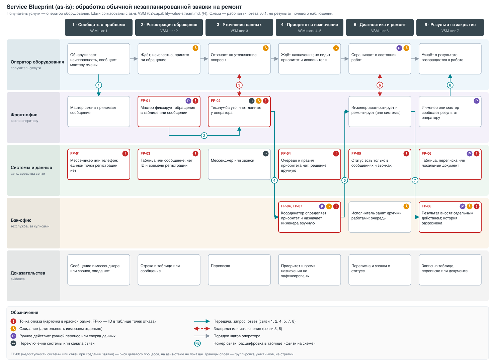

# Experience Pack v0.1

## 1. Краткое описание артефакта

Этот документ показывает, **как работает один сотрудник в целевом процессе и что должно произойти вокруг него, чтобы заявка на ремонт была обработана**. Он продолжает [System Charter](01-system-charter.md) и [Capability & Value Stream](02-capability-value-stream.md): берёт из них роли, шаги as-is VSM и потери W-01…W-05, а результатом даёт точки отказа и требования-кандидаты для Темы 1.4.

**Сценарий:** обычная незапланированная заявка на ремонт, от обнаружения неисправности до закрытия (границы те же, что в [02 §3](02-capability-value-stream.md)). Плановое ТО, аварийный ремонт, IoT-диагностика, закупки и склад запчастей не рассматриваются.

**Источники и статус данных.** Полевого исследования не было: компания и система вымышленные, наблюдений, логов и интервью нет. Поэтому каждое утверждение помечено источником:

| Метка | Значение |
|---|---|
| `[01 §N]`, `[02 §N]` | Зафиксировано в System Charter или в Capability & Value Stream (раздел N) |
| `[Л3 сл.N]` | Метод или правило из лекции 3 (номер слайда) |
| `[Допущение]` | Вывод или предложение этой работы; наблюдением не подтверждено, нужно проверить |

Числа взяты только из `01` и `02`; новых оценок здесь нет. Все они остаются гипотезами, как и в исходных документах.

## 2. Роль, задача и условия работы

**Роль: оператор оборудования** (инициатор заявки). Выбрана потому, что именно с него начинается поток: он обнаруживает проблему, и первые потери W-01 (задержка до регистрации) и W-02 (уточнение неполных данных) возникают на его стыке с мастером смены и техслужбой `[01 §5, 02 §4–5]`.

**Задача (цель Journey):** сообщить о неисправности так, чтобы заявка была зарегистрирована и обработана без повторных уточнений, и понимать, что с ней происходит, пока работы не завершены `[01 §3]`.

**Границы Journey:** одна заявка, одна перспектива. Мастер смены, инженер, координатор и руководитель техслужбы показаны как контекст и в Blueprint, отдельных карт для них нет `[Л3 сл.9]`.

### Четыре условия промышленной среды

Условия заданы лекцией; выраженность проверяется для конкретной роли, а не предполагается `[Л3 сл.6]`.

| Условие | Что известно из Dossier | Профиль для оператора | Чего не знаем |
|---|---|---|---|
| **Цена ошибки** | Задержки ведут к простоям, обращения могут теряться и дублироваться `[01 §2–3]`. Техслужбе нужны сведения для диагностики `[01 §5]` | Ошибка в оборудовании или описании ведёт к лишнему уточнению, неверной диагностике или дублю `[Допущение]`. Запись о заявке исправима, потерянное время простоя вернуть нельзя `[Допущение]` | Стоимость часа простоя `[02 §10]` |
| **Стресс и темп** | Оператору нужно быстро создать заявку; обязательные поля усложняют ввод `[01 §5]` | Заявку создаёт человек, отвлечённый от основной работы, поэтому скорость не должна достигаться за счёт пропуска обязательных данных `[Допущение]` | Нормативы времени на операцию, пиковые периоды, число заявок `[02 §10]` |
| **Разграничение прав** | Роли и интересы описаны `[01 §5]`. Кто меняет приоритет, пока не определено `[02 §10]`. SSO нужно проверить `[01 §8]` | Оператор создаёт заявки и видит их статус, но не назначает исполнителя и не принимает решение о приоритете (матрица ниже) `[Допущение]` | Общий АРМ или персональный; кто регистрирует: оператор, мастер или обе роли `[01 §9]` |
| **Нестабильная связь** | Внешние системы (SSO, справочники, уведомления) предполагаются, доступность не подтверждена `[01 §4]` | **Выраженность не установлена.** Данных о связи на рабочем месте оператора нет, поэтому условие разобрано как гипотеза (сценарии 2, 4, 6, FP-08) `[Допущение]` | Есть ли на рабочих местах зоны без связи, нужен ли автономный режим (OQ-1, OQ-11) |

### Что можно отменить, а что нет

Применяем классификацию лекции к нашему домену `[Л3 сл.28, Допущение]`:

- **Обратимое (отмена):** создание заявки и правка её полей до принятия техслужбой.
- **Компенсируемое (встречное действие):** смена статуса, приоритета, закрытие. Исправляется отдельным действием (переоткрытие, правка) с журналом; исходное событие не стирается.
- **Без отката:** физический ремонт и простой оборудования. Они вне системы, критические проверки нужно делать до них.

### Права (предлагаемая матрица)

Матрица предложена этой работой, она не регламент предприятия и требует согласования с владельцем процесса и ИБ `[Л3 сл.31, Допущение]`.

| Роль | Разрешённые действия | Граница и эскалация |
|---|---|---|
| Оператор оборудования | Создать заявку, видеть свои заявки и статус, добавить комментарий | Не назначает исполнителя и не меняет приоритет; спорное передаёт мастеру смены |
| Мастер смены | Уточнить заявку, предложить повышение приоритета участка | Окончательный приоритет определяют единые правила техслужбы `[01 §5]` |
| Инженер техслужбы | Менять статус и вносить диагностику и результат по назначенным заявкам | Назначенные ему заявки; чужие не закрывает |
| Руководитель или координатор техслужбы | Определять приоритет, назначать исполнителя, контролировать сроки `[02 §2]` | Изменения фиксируются: кто, когда, что |
| ИТ-служба | Доступ и эксплуатация | Не меняет содержание заявок и не закрывает их |

## 3. User Journey оператора (as-is)

Шаги совпадают с as-is VSM `[02 §4]`; это обзор работы роли, а не хронометраж. Оценки времени остаются в `02`, здесь они не повторяются. Столбец «Нагрузка и опыт» заполнен только тем, что следует из документов; **переживания и нагрузку наблюдением не подтверждали**, это пункты плана проверки (ниже) `[Л3 сл.14]`.

| Этап | Действия оператора | Точка контакта | Нужные данные | Нагрузка и опыт | Боль и возможность |
|---|---|---|---|---|---|
| 1. Сообщить о проблеме | Замечает неисправность, формулирует описание, сообщает мастеру смены `[01 §6]` | Мессенджер или телефон, мастер смены | Оборудование, что случилось, влияние на работу `[01 §4, Допущение]` | Нет данных; проверить интервью | **Боль:** единой точки регистрации нет `[01 §6]`. **Возможность:** единая форма заявки |
| 2. Регистрация обращения | Ждёт, пока мастер зафиксирует обращение в таблице или сообщении `[02 §4]` | Таблица, сообщение | Подтверждение, что обращение принято | Нет данных | **Боль:** единого реестра заявок нет, статус приходится уточнять `[01 §2]`. **Возможность:** ID и время регистрации присваивает система `[02 §6]` |
| 3. Уточнение данных | Отвечает на вопросы техслужбы `[02 §4]` | Мессенджер, звонок | Детали неисправности и оборудования | Нет данных | **Боль:** неполное первичное обращение возвращается на уточнение (W-02) `[02 §5]`. **Возможность:** обязательный минимум данных при создании |
| 4. Ожидание приоритета и назначения | Не участвует; ждёт | Нет | Приоритет, ответственный | Нет данных | **Боль:** приоритет и исполнитель определяются вручную, оператор их не видит (W-03) `[02 §5, 01 §6]`. **Возможность:** правила приоритета, видимое назначение |
| 5. Диагностика и ремонт | Узнаёт о ходе работ через сообщения или звонки `[01 §6]` | Мессенджер, звонок | Статус, срок | Нет данных | **Боль:** статус приходится уточнять; по гипотезе Charter около 25% сотрудников не понимают статус `[01 §6]`. **Возможность:** единый статус в карточке |
| 6. Результат и закрытие | Узнаёт, что работы завершены | Сообщение, таблица | Результат, закрыта ли заявка | Нет данных | **Боль:** результат хранится в таблицах, переписке и локальных документах (W-05) `[01 §6, 02 §5]`. **Возможность:** результат в той же карточке |

### Исключения (нормальный путь + 4 проблемных сценария)

| ID | Исключение | Что происходит | Источник |
|---|---|---|---|
| E-1 | Обращение неполное или оборудование названо неточно | Техслужба возвращает на уточнение, цикл повторяется | `[02 §4 шаг 3, 01 §5]` |
| E-2 | Дубль: о той же неисправности сообщили несколько человек | Техслужба получает несколько обращений об одном и том же | `[01 §2, §5]` |
| E-3 | Оператор не знает статус | Повторно пишет или звонит мастеру | `[01 §6]` |
| E-4 | Приоритет оспаривается | Мастер стремится ускорить свой участок, техслужба распределяет специалистов по единым правилам | `[01 §5, конфликт 1]` |

### План проверки Journey

Три источника дополняют друг друга, ни один не заменяет остальные `[Л3 сл.13]`:

1. **Наблюдение смены:** сколько раз и по каким каналам оператор сообщает о проблеме; как проходит обычная и пиковая нагрузка.
2. **Логи:** временные метки в мессенджере и таблицах: когда обнаружено, когда зарегистрировано, когда назначено. Они не покажут физическую работу и переживания.
3. **Интервью после смены:** что было сложным, что делали в обход, где спрашивали мастера.

## 4. Service Blueprint

Цель: показать, **что видит оператор (получатель услуги) и что должно сработать за кулисами**, чтобы заявка была обработана. Это **as-is** с точками отказа, как в учебном примере `[Л3 сл.20–21]`. Целевой процесс показан в разделе 8.

Слои: действия получателя, фронт-офис, системы и данные, бэк-офис, доказательства (evidence) `[Л3 сл.17]`. Шаги согласованы с VSM: этапы 1–6 схемы соответствуют шагам 1–7 `[02 §4]` (приоритет и назначение объединены). Роль «ответственная роль» из VSM в схеме названа мастером смены `[01 §6, Допущение]`.

### Связи на схеме

| № | От → к | Что передаётся | Тип | Источник |
|---|---|---|---|---|
| 1 | Оператор → мастер смены | Сообщение или звонок о неисправности | Передача | `[02 §4 шаг 1]` |
| 2 | Мастер смены → техслужба | Обращение, переданное вручную | Передача | `[02 §4 шаг 2]` |
| 3 | Техслужба ↔ оператор | Уточняющие вопросы и ответы | Задержка | `[02 §4 шаг 3]` |
| 4 | Техслужба → координатор | Обращение на определение приоритета | Передача | `[02 §4 шаг 4]` |
| 5 | Координатор → инженер | Назначение исполнителя | Передача | `[02 §4 шаг 5]` |
| 6 | Оператор ↔ мастер, инженер | Запрос статуса, ответ позже | Задержка | `[01 §6 п.6]` |
| 7 | Инженер → фиксация результата | Результат работ | Передача | `[02 §4 шаг 6]` |
| 8 | Инженер или мастер → оператор | Результат, закрытие | Передача | `[02 §4 шаг 7]` |

Evidence на схеме показывает, **какой артефакт остаётся на шаге**, а не гарантию успеха. Единого реестра нет, поэтому след остаётся в переписке, таблицах и локальных документах `[01 §2]`; на этапе 4 фиксация приоритета и времени назначения в источниках не описана `[Допущение]`.

## 5. Точки отказа

Для каждой точки: что произошло, что можно восстановить, как защитить, кто отвечает `[Л3 сл.12, 23]`. Владельцы предварительные: роли из Dossier, организационная структура неизвестна `[02 §2, §9]`.

| ID | Точка отказа | Последствие и что можно восстановить | Потеря | Защита (предложение) | Владелец |
|---|---|---|---|---|---|
| FP-01 | Обращение теряется или искажается при ручной передаче оператор → мастер → техслужба | Заявки нет или она задержана. Запись можно найти в переписке, если сохранилась; потерянное время простоя не вернуть | W-01 | Единый реестр, устойчивый ID, время регистрации | Руководитель техслужбы совместно с владельцем производственного процесса `[02 §8]` |
| FP-02 | Неполные данные или неверное оборудование | Возврат на уточнение, задержка диагностики. Поля исправимы | W-02 | Обязательный минимум данных, оборудование из справочника | Руководитель техслужбы (состав полей: OQ-4) |
| FP-03 | Дубль обращения | Два исполнителя на одну неисправность или путаница с очередью. Дубли можно объединить после разбора | W-02 (гипотеза) | Показать открытые заявки по оборудованию при создании; решение об объединении за человеком | Координатор техслужбы |
| FP-04 | Приоритет и исполнитель назначаются вручную | Критичная заявка ждёт; решение зависит от доступности роли. Приоритет исправим, время ожидания нет | W-03 | Согласованные правила приоритета, спорные случаи в эскалацию | Руководитель техслужбы `[02 §2]` |
| FP-05 | Статус неизвестен оператору | Повторные запросы, дубли, отвлечение участников. Статус можно восстановить из переписки | W-03, W-04 (частично) | Единый статус и ответственный, видимые инициатору | Руководитель техслужбы |
| FP-06 | Результат не зафиксирован или зафиксирован с задержкой; закрытие без подтверждения | История неполна, повторная неисправность не отслеживается. Запись исправима с аудитом | W-05 | Результат вносится в той же карточке; закрытие требует результата | Руководитель техслужбы |
| FP-07 | Приоритет или статус изменены без полномочий | Нарушается очерёдность, теряется доверие к правилам. Исправляется встречным действием с журналом | W-03 | Матрица прав; журнал «кто, когда, что» `[01 §5, конфликт 1]` | Руководитель техслужбы, ИТ-служба (доступ) |
| FP-08 | Система или связь недоступны в момент создания заявки (риск to-be, **гипотеза**) | Оператор возвращается к мессенджеру, а потери as-is возвращаются. Данные нужно внести позже | W-01 | Резервный канал с обязательным внесением в систему позже; решение зависит от OQ-1, OQ-11 | ИТ-служба `[01 §5]` |

## 6. Требования-кандидаты

Семь кандидатов: 5 FR и 2 NFR. Формулировки пока в обычной форме; по шаблону EARS и с критериями «Дано — Когда — Тогда» их переписывает Тема 1.4. ID устойчивы и не меняются при правке формулировок. Источник требования: точка карты, правило процесса или внешнее ограничение `[Л3 сл.42]`.

| ID | Тип | Формулировка | Источник | Проверка | Статус |
|---|---|---|---|---|---|
| FR-01 | FR | Система должна позволять инициатору создать заявку с минимальным обязательным набором данных (оборудование, описание, категория), присвоить ей устойчивый ID и зафиксировать время регистрации | FP-01, FP-02; `[01 §4 In Scope]`, `[02 §6 п.1–2]` | Сценарий прототипа «создать заявку»: после отправки виден ID и время | Гипотеза: состав полей не согласован `[01 §9]` |
| FR-02 | FR | При создании заявки система должна показывать открытые заявки по выбранному оборудованию и предупреждать о возможном дубле, не блокируя создание | FP-03; `[01 §5, конфликт 2]` | Прототип: вторая заявка на то же оборудование вызывает предупреждение | Гипотеза: допустимость блокировки не обсуждалась |
| FR-03 | FR | Система должна показывать инициатору текущий статус и ответственного по его заявке и сохранять историю смены статусов со временем и автором | FP-05; `[01 §3]`, `[02 §6 п.7]` | Экран «мои заявки» в прототипе; интервью: доля сотрудников, которым неясен статус (гипотеза baseline около 25%, `[01 §6]`) | Гипотеза |
| FR-04 | FR | Система должна разрешать менять приоритет и назначать исполнителя только ролям с таким полномочием и фиксировать кто, когда и что изменил | FP-04, FP-07; `[02 §6 п.4–5]`, `[02 §10]` | Матрица прав; тест: действие вне роли отклонено, попытка в журнале | Гипотеза: кто имеет право, не определено (OQ-5) |
| FR-05 | FR | Система не должна переводить заявку в «закрыта», пока не внесён результат работ | FP-06; `[01 §4]`, `[02 §6 п.6–7]` | Сценарий прототипа; метрика KPI-3 (ниже) | Гипотеза: кто подтверждает закрытие, не определено (OQ-6) |
| NFR-01 | NFR (скорость процесса) | Время от обнаружения проблемы до появления зарегистрированной заявки должно быть не более 10 минут | W-01; `[02 §8 KPI-1]` | Замер по временным меткам; сначала определить, как фиксировать момент обнаружения (OQ-7) | Гипотеза: цель KPI до первичного замера |
| NFR-02 | NFR (надёжность) | При недоступности системы или связи в момент создания заявка не должна теряться: оператор должен однозначно видеть, зарегистрирована ли она, и знать порядок дальнейших действий | FP-08; сценарии 2, 4, 6 | Прототип нештатной ветки; при необходимости Spike (Тема 1.4) | Гипотеза: **мера не задана**, нет данных о связи (OQ-1, OQ-11) |

NFR-01 — целевой показатель способности, а не время отклика экрана: оно включает время человека. Время отклика интерфейса как отдельная мера не задана.

## 7. Стресс-сценарии

Шесть сценариев лекции адаптированы к роли оператора; там, где исходный сценарий не применим, это обосновано `[Л3 сл.38, 42]`. Это сценарная проверка, а не нагрузочный тест.

| № | Сценарий и адаптация | Что делает роль | Что сохраняется | Что запрещено | Кто завершает разбор |
|---|---|---|---|---|---|
| 1 | **Пик: много обращений по одному событию** (аналог «приём рейса при очереди»; приёмки партий и очереди получателей в наших документах нет) | Создаёт заявку, видит предупреждение о дубле (FR-02) | Все заявки с временем регистрации | Автоматически удалять или сливать заявки без решения человека `[Допущение]` | Координатор техслужбы объединяет дубли `[Допущение]` |
| 2 | **Связь пропала после отправки заявки** (аналог «связь пропала после передачи заказа») | Видит «отправка не подтверждена»; не создаёт вторую заявку вслепую | Факт попытки (если автономная запись вообще допускается, OQ-11) | Считать локальную запись зарегистрированной заявкой; создавать дубль молча `[Л3 сл.32–33]` | Мастер смены, затем ИТ-служба |
| 3 | **Заявка не прошла проверку:** нет обязательных данных, оборудование не найдено, нет права на действие (аналог «получатель не прошёл проверку») | Исправляет данные или обращается к мастеру смены | Введённые данные не теряются `[Допущение]` | Обходить проверку: создавать заявку без обязательных данных или на произвольное оборудование | Мастер смены, затем координатор техслужбы |
| 4 | **Запрос во внешнюю систему отправлен, ответа нет** (аналог «запрос оплаты ушёл, ответа нет»: платежей в системе нет, финансовый учёт вне границ `[01 §4]`; роль платежа у справочника оборудования, SSO или сервиса уведомлений) | Видит статус «неизвестно», отдельный от успеха и от ошибки | Введённые данные и время попытки | Считать неизвестный исход отказом или успехом `[Л3 сл.39]` | ИТ-служба; работа продолжается через резервный канал мастера |
| 5 | **Новичок встретил спорную операцию:** не знает категорию или приоритет (аналог сценария лекции) | Передаёт вопрос мастеру смены; предложенный приоритет не окончательный (FR-04) | Введённые данные, пометка «нужен разбор» | Самостоятельно присваивать окончательный приоритет | Мастер смены, затем координатор техслужбы |
| 6 | **Отказ рабочего места или недоступность системы** (аналог «отказ сканера, принтера или терминала»; сканеры и принтеры в Charter не упоминаются) | Передаёт обращение мастеру смены по резервному каналу (сегодняшние мессенджер или звонок) | Факт обращения; мастер вносит его в систему позже | Терять обращение; превращать резервный канал в постоянный обход `[Допущение]` | Мастер смены вносит заявку, ИТ-служба восстанавливает рабочее место |

**Гипотезы и открытые вопросы к сценариям:** кто объединяет дубли (OQ-8); поддерживается ли автономная запись и на какой срок (OQ-11); какие внешние системы действительно используются (OQ-10); как выглядит резервный порядок и кто за него отвечает (OQ-1).

## 8. Связь с потерями и гипотезы для замера

Денежная оценка не делается: данных нет `[02 §5]`. Указаны вид потери и то, что измерять. Потери из `02` не равны экономии проекта, эффект подтверждается сравнением до и после `[Л3 сл.24]`.

| Потеря | Точки отказа | Что меняет целевой процесс `[02 §6]` | Что измеряем | Baseline → target |
|---|---|---|---|---|
| W-01 регистрация | FP-01, FP-08 | Единый реестр, устойчивый ID, время регистрации | Время от обнаружения до регистрации | 35 → не более 10 мин `[02 §8]` (гипотеза) |
| W-02 уточнение | FP-02, FP-03 | Обязательный минимум данных, предупреждение о дубле | Доля заявок, возвращённых на уточнение; число дублей | Не измерено |
| W-03 приоритизация и назначение | FP-04, FP-05, FP-07 | Правила приоритета, назначение с временем, единый статус | Время от регистрации до назначения исполнителя; доля сотрудников с непонятным статусом | 95 → не более 30 мин `[02 §8]`; статус: около 25% → менее 5% `[01 §6]` (гипотезы) |
| W-04 очередь исполнителя | FP-05 (частично) | Напрямую не адресуется: система устраняет лишь часть `[02 §5]` | Интервалы «назначен → начало работ → завершено» | Не измерено |
| W-05 фиксация результата | FP-06 | Результат и история в одной карточке | Время от завершения работ до зафиксированного результата | 35 → не более 5 мин `[02 §8]` (гипотеза) |

## 9. Открытые вопросы

Унаследованные от прошлых тем остаются открытыми `[01 §9, 02 §10]`; ниже добавлены вопросы, возникшие в этой теме.

| ID | Вопрос | Влияет на |
|---|---|---|
| OQ-1 | Какая связь на рабочих местах операторов: есть ли зоны без связи, каков резервный порядок | Условие «связь», FP-08, NFR-02, сценарии 2, 4, 6 |
| OQ-2 | Рабочее место оператора общее или персональное; используются ли индивидуальные учётные записи | Условие «права», FR-04 |
| OQ-3 | Кто регистрирует заявку: оператор, мастер или обе роли `[01 §9]` | Выбор роли для Journey, FR-01 |
| OQ-4 | Какие поля обязательны при создании `[01 §9]` | FR-01, FP-02 |
| OQ-5 | Правила приоритета и кто может его менять `[01 §9, 02 §10]` | FR-04, FP-04, FP-07 |
| OQ-6 | Кто подтверждает результат и закрывает заявку `[01 §9]` | FR-05, FP-06 |
| OQ-7 | Как фиксировать момент «обнаружения проблемы» для KPI-1 | NFR-01 |
| OQ-8 | Кто и по каким признакам объединяет дубли | FR-02, сценарий 1 |
| OQ-9 | Нормативы времени на создание заявки и пиковые периоды | Условие «темп» |
| OQ-10 | Какая система достоверно хранит данные об оборудовании и сотрудниках `[01 §9]` | FR-01, сценарии 3, 4 |
| OQ-11 | Нужен ли автономный режим и какие операции в нём допустимы | NFR-02, сценарий 2 |
| OQ-12 | Какие события требуют уведомлений `[01 §9]` | FR-03 |
